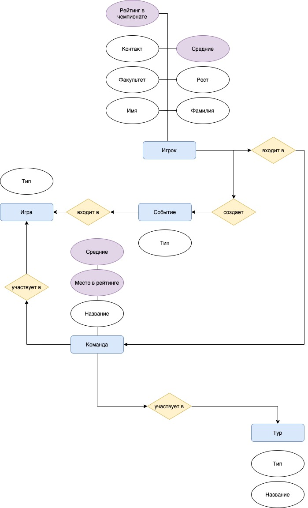
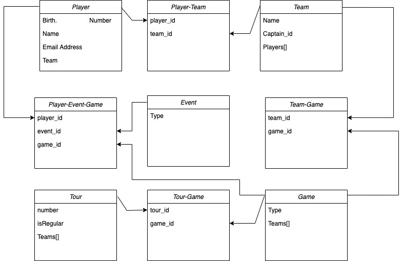

## Домашние задания по курсу SQL:

-   [ДЗ1](#HW1)
-   [ДЗ2](#HW2)
-   [ДЗ3](#HW3)
-   [ДЗ4](#HW4)
-   [ДЗ5](#HW5)
-   [ДЗ6](#HW6)
-   [ДЗ7](#HW7)
-   [ДЗ8](#HW8)
-   [ДЗ9](#HW9)

### <a name="HW1"></a> [ДЗ 1]
#### Описание предметной области и планирование БД
Я участвую в создании проекта под названием HSE 3x3 [ВК страница лиги](https://vk.com/hse3x3), [Сайт лиги](https://3x3.hse.ru/). Данный проект -- лига по баскетболу 3 на 3 среди студентов, выпускников и работников Вышки. В рамках проекта, для улучшения работы различных отделов, для проведения аналитики и для прочих организационных нужд мы собираем данные по каждому прошедшему в лиге матчу. В данный момент сбор данных до боли примитивен -- в ходе игры мы записываем самые ключевые события (забитые мячи и фолы) в протокол, далее специальные люди переписывают эти протоколы в таблицу excel. Мне, как студенту ФКН, больно смотреть на данный процесс, поэтому мне очень хочется автоматизировать сбор инофрмации по игре, а так же сделать возможным в реальном времени собирать бОльшее число значимых для статистики данных, например, подборы, фолы соперника, передачи и т.д. 

Таким образом, хочется создать БД, в которую с помощью в перспективе разбработанного мной фронтенда можно будет легко заполнять все данные по играм прямо во время игры, а потом, с помощью различных хранимых функций, триггеров и кастомных запросов, получать более глубокую аналитику по нашим событиям. Для начала построю представляемую мной диаграмму БД и подробно опишу ее. 



Синим цветом обозначены сущности БД, желтым - связи между ними, фиолетовым - вычисляемые значения, а белым - обычные атрибуты сущностей. 

Начнем с описания сущностей.

-  Игрок
Среди всех атрибутов неочевиден здесь только вычисляемый - "Средние". Под этим атрибутом понимается хранение и обновление вычисляемых свойств. В каждую игру игрок совершает ряд действий, например, забивает сколько-то очков, забирает сколько-то подборов. Для статистики важно понимать, сколько в среднем за все игры игрок делает таких действий. Хранить будем по каждому из типов событий отдельно. Игрок связан с командой отношением N:1, это значит, что игрок может быть участником только одной команды, при этом в одну команду может входить неограниченное количество игроков.

-  Команда
Средние считаются аналогично, только уже для всей команды сразу. Комада связана связью "участвует" с сущностями "Тур" и "Игра". Связи типа N:N. В одну игру может играть несколько команд, при этом каждая команда играет в неограниченном количестве игр, аналогично с туром.

- Тур
В нашей организации игры проходят в несколько Туров. Один тур - это полноценный чемпионат с групповым этапом и этапом плей-офф. При этом у нас есть регулярные туры и два финальных тура, они отличаются только значимостью призов и названием, но для статистики разделять их важно.

- Игра
В каждом туре проходит много игр. При этом игры разделаются на игры в группе и игры в плей-офф, для чего вводится атрибут "Тип". 

- Событие
Ключевая сущность для нашей БД. Планируется записывать каждое событие, создаваемое игроком в конкретной игре как отдельную запись. Например, Вася забивает в игре против Bobcats и мы пишем Вася, Игра id, Тип события - гол. 
Сущность "событие" связана с сущностью "игрок" связью n:1 -- ровно один игрок может создавать неограниченное число событий. Так же данная сущность связана с сущностью "игра" связью 1:n -- событие может входить ровно в одну игру, при этом в одну игру может входить много событий. Данный тип связи можно объеденить в тернарную связь (смотри TRD)

Далее прикладываю диаграмму TRD. 


### <a name="HW2"></a> [ДЗ 2]
#### №1
>Попробуйте ввести в таблицу aircrafts строку с таким значением атрибута
«Код самолета» (aircraft_code), которое вы уже вводили

Можно заметить, что в таблице `aircrafts` атрибут `aircraft_code` является `PRIMARY_KEY`, а мы знаем, что при реализации ключа таблицы создается индекс, главное свойтсво которого -- уникальность. 
#### №2
>Предложение ORDER BY команды SELECT позволяет отсортировать данные при
выводе. По умолчанию сортировка выполняется по возрастанию значений атрибута, указанного в этом предложении. Но можно упорядочить строки и по
убыванию значения атрибута. Для этого нужно после имени атрибута в предложении ORDER BY добавить ключевое слово DESC (это сокращение от слова
descendant — убывающий порядок). Самостоятельно напишите команду для выборки всех строк из таблицы aircrafts, чтобы строки были упорядочены по убыванию значения атрибута «Максимальная дальность полета, км» (range).

`
SELECT * FROM aircrafts ORDER BY range DESC;
`
Вывод:
```
 aircraft_code |        model        | range 
---------------+---------------------+-------
 773           | Boeing 777-300      | 11100
 763           | Boeing 767-300      |  7900
 319           | Airbus A319-100     |  6700
 320           | Airbus A320-200     |  5700
 321           | Airbus A321-200     |  5600
 733           | Boeing 737-300      |  4200
 SU9           | Sukhoi SuperJet-100 |  3000
 CR2           | Bombardier CRJ-200  |  2700
 CN1           | Cessna 208 Caravan  |  1200
```
#### №3
> Команда UPDATE позволяет в процессе обновления выполнять арифметические
действия над значениями, находящимися в строках таблицы. Представим себе,
что двигатели самолета Sukhoi SuperJet стали в два раза экономичнее, вследствие чего дальность полета этого лайнера возросла ровно в два раза. Команда
UPDATE позволяет увеличить значение атрибута range в строке, хранящей информацию об этом самолете, даже не выполняя предварительно выборку с целью выяснения текущего значения этого атрибута. При присваивании нового значения атрибуту range можно справа от знака «=» написать не только числовую константу, но и целое выражение. В нашем случае оно будет простым:
range = range * 2. Самостоятельно напишите команду UPDATE полностью, при
этом не забудьте, что увеличить дальность полета нужно только у одной модели — Sukhoi SuperJet, поэтому необходимо использовать условие WHERE. Затем
с помощью команды SELECT проверьте полученный результат.

`UPDATE aircrafts
    SET range = range * 2
    WHERE model = ’Sukhoi SuperJet-100’;`
    
`SELECT * FROM aircrafts
    ORDER BY range DESC;`
    
```
 aircraft_code |        model        | range 
---------------+---------------------+-------
 773           | Boeing 777-300      | 11100
 763           | Boeing 767-300      |  7900
 319           | Airbus A319-100     |  6700
 SU9           | Sukhoi SuperJet-100 |  6000
 320           | Airbus A320-200     |  5700
 321           | Airbus A321-200     |  5600
 733           | Boeing 737-300      |  4200
 CR2           | Bombardier CRJ-200  |  2700
 CN1           | Cessna 208 Caravan  |  1200
```
#### №4
> Если в предложении WHERE команды DELETE вы укажете логически и синтаксически корректное условие, но строк, удовлетворяющих этому условию, в таблице не окажется, то в ответ СУБД выведет сообщение
DELETE 0
Такая ситуация не является ошибкой или сбоем в работе СУБД. Например, если после удаления какой-то строки вы повторно попытаетесь удалить ее же, то
получите именно такое сообщение.
Самостоятельно смоделируйте описанную ситуацию, подобрав условие, которому гарантированно не соответствует ни одна строка в таблице «Самолеты»
(aircrafts).

INPUT : `DELETE FROM aircrafts
        WHERE range > 100000000;`
        
OUTPUT : `DELETE 0`

`SELECT * FROM aircrafts
    ORDER BY range DESC;`
    
Возвращает 

```
 aircraft_code |        model        | range 
---------------+---------------------+-------
 773           | Boeing 777-300      | 11100
 763           | Boeing 767-300      |  7900
 319           | Airbus A319-100     |  6700
 SU9           | Sukhoi SuperJet-100 |  6000
 320           | Airbus A320-200     |  5700
 321           | Airbus A321-200     |  5600
 733           | Boeing 737-300      |  4200
 CR2           | Bombardier CRJ-200  |  2700
 CN1           | Cessna 208 Caravan  |  1200
```
Такую же таблицу без изменений.

### <a name="HW3"></a> [ДЗ 3]
#### №2
>Предположим, что возникла необходимость хранить в одном столбце таблицы
данные, представленные с различной точностью. Это могут быть, например,
результаты физических измерений разнородных показателей или различные
медицинские показатели здоровья пациентов (результаты анализов). В таком
случае можно использовать тип numeric без указания масштаба и точности.
Команда для создания таблицы может быть, например, такой:
` CREATE TABLE test_numeric ( measurement numeric, description text ); `
Если у вас в базе данных уже есть таблица с таким же именем, то можно предварительно ее удалить с помощью команды
`DROP TABLE test_numeric;`
Вставьте в таблицу несколько строк:
`INSERT INTO test_numeric VALUES ( 1234567890.0987654321, 'Точность 20 знаков, масштаб 10 знаков' );`
`INSERT INTO test_numeric VALUES ( 1.5, 'Точность 2 знака, масштаб 1 знак' );`
`INSERT INTO test_numeric VALUES ( 0.12345678901234567890, 'Точность 21 знак, масштаб 20 знаков' );`
`INSERT INTO test_numeric VALUES ( 1234567890, 'Точность 10 знаков, масштаб 0 знаков (целое число)' );`
Теперь сделайте выборку из таблицы и посмотрите, что все эти разнообразные
значения сохранены именно в том виде, как вы их вводили.

` SELECT * from test_numeric`
Вывод команды:
```
      measurement       |                    description                     
------------------------+----------------------------------------------------
  1234567890.0987654321 | Точность 20 знаков, масштаб 10 знаков
                    1.5 | Точность 2 знака, масштаб 1 знак
 0.12345678901234567890 | Точность 21 знак, масштаб 20 знаков
             1234567890 | Точность 10 знаков, масштаб 0 знаков (целое число)
```

#### №4
>При работе с числами типов real и double precision нужно помнить, что
сравнение двух чисел с плавающей точкой на предмет равенства их значений
может привести к неожиданным результатам.

Задания из примера отработали корректно, попробуем запросы на верхней границе:

`SELECT '10e37'::real > '11e37'::real;`

OUTPUT:
```
 ?column? 
----------
 f
(1 row)
```

`SELECT '1e308'::double precision > '12e307'::double precision;`

OUTPUT:
```
 ?column? 
----------
 f
(1 row)
```

На верхних границах все тоже работает корректно.
#### №8
Для начала создадим таблицу по заданию 8
`CREATE TABLE test_serial
( id serial PRIMARY KEY,
name text
);`

Далее вставим значение: 
`INSERT INTO test_serial ( name ) VALUES ( 'Вишневая' );`
```
 id |   name   
----+----------
  1 | Вишневая
```

Явно зададим значение столбца id:
`INSERT INTO test_serial ( id, name ) VALUES ( 2, 'Прохладная' );`

```
 id |    name    
----+------------
  1 | Вишневая
  2 | Прохладная
```

При выполнении этой команды СУБД выдаст сообщение об ошибке. Почему?
`INSERT INTO test_serial ( name ) VALUES ( 'Грушевая' );`
Происходит ошибка, так как внутренний счетчик `serial` при вставке Грушевой встал на значение 2, которое уже есть в таблице, из-за чего сработало ограничение уникальности `id`. При последующем запросе вставка работает, так как счетчик поднялся до значния выше.

`INSERT INTO test_serial ( name ) VALUES ( 'Грушевая' );`

```
 id |    name    
----+------------
  1 | Вишневая
  2 | Прохладная
  3 | Грушевая
```

Добавим еще одну строку.
`INSERT INTO test_serial ( name ) VALUES ( 'Зеленая' );`

А теперь удалим ее же.
`DELETE FROM test_serial WHERE id = 4;`

Добавим последнюю строку.
`INSERT INTO test_serial ( name ) VALUES ( 'Луговая' );`

Теперь сделаем выборку.
`SELECT * FROM test_serial;`

```
 id |    name    
----+------------
  1 | Вишневая
  2 | Прохладная
  3 | Грушевая
  5 | Луговая
```
Вы увидите, что в нумерации образовалась «дыра». Это из-за того, что при формировании нового значения из последовательности поиск максимального значения, уже имеющегося в столбце, не выполняется.

#### №12
После выполнения `SET datestyle TO 'MDY';` команда `SELECT '18-05-2016'::date;`
будет вызывать ошибку, так как мы поставили формат ввода, где месяц стоит на первом месте.
```
ERROR:  date/time field value out of range: "18-05-2016"
LINE 1: SELECT '18-05-2016'::date;
               ^
HINT:  Perhaps you need a different "datestyle" setting.
```

Теперь посмотрим на работу timestamp:

`SELECT '18-05-2016'::timestamp;`

Получаем аналогичное поведение:
```
ERROR:  date/time field value out of range: "18-05-2016"
LINE 1: SELECT '18-05-2016'::timestamp;
               ^
HINT:  Perhaps you need a different "datestyle" setting.
```

При смене параметров даты, все заработает ок:
`SET datestyle TO 'Postgres, DMY';`

Все заработает, как и описано в задании. 

`SELECT '18-05-2016'::timestamp;`

```
        timestamp         
--------------------------
 Wed 18 May 00:00:00 2016
(1 row)
```

#### №15
`SELECT to_char( current_timestamp, 'mi:ss' );`
Должен вывести секунды, и, скорее всего, минуты или миллисекунды. 

```
 to_char 
---------
 22:51
(1 row)
```

Вывод - минуты и секунды.

`SELECT to_char( current_timestamp, 'dd' );` 
Введет дни.
```
 to_char 
---------
 20
(1 row)
```

`SELECT to_char( current_timestamp, 'yyyy-mm-dd' );`
Данная команда должна вывести текущую дату в привчном формате.

```
  to_char   
------------
 2021-12-20
(1 row)
```

Эксперимент:
`SELECT to_char( current_timestamp, 'yyyy-mm-dd mi:hh:ss' );`

```
       to_char       
---------------------
 2021-12-20 26:07:09
(1 row)
```

#### №21
По запросу `SELECT ( '2016-01-31'::date + '1 mon'::interval ) AS new_date;`
Думаю, что получим последний день второго месяца -- так как мы прибавляем интервал ровно в 1 месяц. 
```
         new_date         
--------------------------
 Mon 29 Feb 00:00:00 2016
(1 row)
```

В команде `SELECT ( '2016-02-29'::date + '1 mon'::interval ) AS new_date;`
Все не так очевидно - к последнему дню февраля мы прибавляем интервал в 1 месяц - должно получиться либо последний день марта, либо какое-то из последних чисел месяца (потому что в феврале мало дней и непонятно, как распределится интервал).
```
         new_date         
--------------------------
 Tue 29 Mar 00:00:00 2016
(1 row)
```

#### №30
Ожидаю, что все команды, в которых нет прямого приведения переменных к нужному типу, или переменные не в кавычках, будут падать с ошибкой, например: 

`INSERT INTO test_bool VALUES ( 1, 'true' );`
Здесь 1 -- явно не типа `boolean`, и не указывается кастование его в этот тип, поэтому поймаем ошибку.

```
ERROR:  column "a" is of type boolean but expression is of type integer
LINE 1: INSERT INTO test_bool VALUES ( 1, 'true' );
                                       ^
HINT:  You will need to rewrite or cast the expression.
```

Так же есть запрос `INSERT INTO test_bool VALUES ( 't', truth );`

Где `truth` -- это какая-то необъявленная нигде переменная, на которую будет ругаться программа.
```
ERROR:  column "truth" does not exist
LINE 1: INSERT INTO test_bool VALUES ( 't', truth );
```

#### №33
Создаем таблицу:
`CREATE TABLE pilots ( pilot_name text, schedule integer[], meal text[][]);`

Вставляем значения из примера, только с двумерным массивом
```
 INSERT INTO pilots
    VALUES ('Ivan', '{ 1, 3, 5, 6, 7 }'::integer[],
             '{ { "сосиска", "макароны", "кофе" },
                { "сосиска", "макароны", "кофе" },
                { "сосиска", "макароны", "кофе" },
                { "сосиска", "макароны", "кофе" } }'::text[][]
           ),
           ( 'Petr', '{ 1, 2, 5, 7 }'::integer [],
             '{ { "котлета", "каша", "кофе" },
                { "котлета", "каша", "кофе" },
                { "котлета", "каша", "кофе" },
                { "котлета", "каша", "кофе" } }'::text[][]
           ),
           ( 'Pavel', '{ 2, 5 }'::integer[],
             '{ { "сосиска", "каша", "кофе" },
                { "сосиска", "каша", "кофе" },
                { "сосиска", "каша", "кофе" },
                { "сосиска", "каша", "кофе" } }'::text[][]
           ),
           ( 'Boris', '{ 3, 5, 6}'::integer[],
             '{ { "котлета", "каша", "чай" },
                { "котлета", "каша", "чай" },
                { "котлета", "каша", "чай" },
                { "котлета", "каша", "чай" } }'::text[][]
       );
```

Рубрика эксперименты:

`SELECT * FROM pilots;`

```
 pilot_name |  schedule   |                                               meal             
                                   
------------+-------------+----------------------------------------------------------------
-----------------------------------
 Ivan       | {1,3,5,6,7} | {{сосиска,макароны,кофе},{сосиска,макароны,кофе},{сосиска,макар
оны,кофе},{сосиска,макароны,кофе}}
 Petr       | {1,2,5,7}   | {{котлета,каша,кофе},{котлета,каша,кофе},{котлета,каша,кофе},{к
отлета,каша,кофе}}
 Pavel      | {2,5}       | {{сосиска,каша,кофе},{сосиска,каша,кофе},{сосиска,каша,кофе},{с
осиска,каша,кофе}}
 Boris      | {3,5,6}     | {{котлета,каша,чай},{котлета,каша,чай},{котлета,каша,чай},{котл
ета,каша,чай}}
```

`SELECT pilot_name FROM pilots
WHERE meal[1][1:3] && '{"сосиска"}'::text[];`

```
 pilot_name 
------------
 Ivan
 Pavel
(2 rows)
```

`UPDATE pilots
    SET meal[1][3] = 'пирожок'
    WHERE pilot_name = 'Pavel';`
    
`SELECT meal FROM pilots WHERE pilot_name = 'Pavel';`

```
                                         meal                                         
--------------------------------------------------------------------------------------
 {{сосиска,каша,пирожок},{сосиска,каша,кофе},{сосиска,каша,кофе},{сосиска,каша,кофе}}
```

#### №35
Примеры изученных запросов
`SELECT '{"sports" : "хоккей"}'::jsonb->'sports';`

```
 ?column? 
----------
 "хоккей"
```

`SELECT '{"sports" : "хоккей"}'::jsonb->>'sports';`

```
 ?column? 
----------
 хоккей
(1 row)
```

`SELECT '{"a" : {"b" : "c"}}'::jsonb#>'{a, b}';`

```
 ?column? 
----------
 "c"
(1 row)
```

`SELECT '{"a":1, "b":2}'::jsonb @> '{"b":2}'::jsonb;`

```
 ?column? 
----------
 t
(1 row)
```

`SELECT '{"a":1}'::jsonb <@ '{"a":1, "b":2}'::jsonb;`

```
 ?column? 
----------
 t
(1 row)
```

`SELECT '{"a":1, "b":2}'::jsonb ?& array['a', 'b'];`

```
 ?column? 
----------
 t
(1 row)
```
### <a name="HW4"></a> [ДЗ 4]
#### №2
> Посмотрите, какие ограничения уже наложены на атрибуты таблицы «Успеваемость» (progress). Воспользуйтесь командой \d утилиты psql. А теперь предложите для этой таблицы ограничение уровня таблицы.


### <a name="HW5"></a> [ДЗ 5]
#### №2
> Предложите шаблон поиска в операторе LIKE для выбора из этой таблицы всех
пассажиров с фамилиями, состоящими из пяти букв.

`SELECT passenger_name
FROM tickets
WHERE passenger_name LIKE '% _____';`

#### №7
> К сожалению, в этой выборке информация дублируется. Пары городов приведены по два раза: для рейса «туда» и для рейса «обратно». Модифицируйте запрос
таким образом, чтобы каждая пара городов была выведена только один раз:

INPUT:
```
SELECT DISTINCT least(departure_city, arrival_city), greatest(departure_city, arrival_city),
FROM routes r
JOIN aircrafts a ON r.aircraft_code = a.aircraft_code
WHERE a.model = 'Boeing 777-300'
ORDER BY 1;
```
#### №9
> А с помощью какого запроса можно получить результат в таком виде?
```
departure_city | arrival_city | count
----------------+-----------------+-------
Москва | Санкт-Петербург | 12
```

С помощью
```
SELECT departure_city, arrival_city, count( * )
FROM routes
WHERE departure_city = 'Москва'
AND arrival_city = 'Санкт-Петербург';
```

#### №13
> А как выявить те направления, на которые не было продано ни одного билета?
Один из вариантов решения такой: если на рейсы, отправляющиеся по какомуто направлению, не было продано ни одного билета, то максимальная и минимальная цены будут равны NULL. Нужно получить выборку в таком виде:

```
departure_city | arrival_city | max | min
---------------------+---------------------+-----------+----------
Абакан | Архангельск | |
Абакан | Грозный | |
Абакан | Кызыл | |
Абакан | Москва | 101000.00 | 33700.00
Абакан | Новосибирск | 5800.00 | 5800.00
```

INPUT:

```
SELECT f.departure_city, f.arrival_city, max( tf.amount ), min( tf.amount )
  FROM flights_v f
  LEFT JOIN ticket_flights tf ON f.flight_id = tf.flight_id
  GROUP BY 1, 2
  ORDER BY 1, 2;
```

#### №19

> В разделе 6.4 мы использовали рекурсивный алгоритм в общем табличном выражении. Изучите этот пример, чтобы лучше понять работу рекурсивного алгоритма:

```
WITH RECURSIVE ranges ( min_sum, max_sum )
AS (
    VALUES( 0, 100000 ),
        ( 100000, 200000 ),
        ( 200000, 300000 )
    UNION ALL
    SELECT min_sum + 100000, max_sum + 100000
    FROM ranges
    WHERE max_sum < ( SELECT max( total_amount ) FROM bookings )
)
SELECT * FROM ranges;
```

> Задание 1. Модифицируйте запрос, добавив в него столбец level (можно назвать его и iteration). Этот столбец должен содержать номер текущей итерации, поэтому нужно увеличивать его значение на единицу на каждом шаге. Не
забудьте задать начальное значение для добавленного столбца в предложении
VALUES.
Задание 2. Для завершения экспериментов замените UNION ALL на UNION и
выполните запрос. Сравните этот результат с предыдущим, когда мы использовали UNION ALL.

Модификация : 
```
WITH RECURSIVE ranges ( min_sum, max_sum )
AS (
    VALUES( 0, 100000 ),
        ( 100000, 200000 ),
        ( 200000, 300000 )
    UNION ALL
    SELECT level + 1, min_sum + 100000, max_sum + 100000
    FROM ranges
    WHERE max_sum < ( SELECT max( total_amount ) FROM bookings )
)
SELECT * FROM ranges;
```

Для данных запросов `UNION ALL` на каждой итерации добавляла по 3 строки, а `UNINON` ровно по 1.

Вывод соотвественно: `36 rows returned`, `13 rows returned`. Опустил вывод таблиц, т.к они довольно большие и займут много места.
### <a name="HW6"></a> [ДЗ 6]
#### №1
> Добавьте в определение таблицы aircrafts_log значение по умолчанию
current_timestamp и соответствующим образом измените команды INSERT,
приведенные в тексте главы.

`CREATE TEMP TABLE aircrafts_log AS
SELECT * FROM aircrafts WITH NO DATA;`

```
ALTER TABLE aircrafts_log
ADD COLUMN when_add timestamp;
```

```
ALTER TABLE aircrafts_log
ALTER COLUMN when_add SET DEFAULT current_timestamp;
```

```
WITH add_row AS
    ( 
        INSERT INTO aircrafts_tmp
        VALUES ( 'TEST', 'TEST-3000', 3000 )
        ON CONFLICT DO NOTHING
        RETURNING *
    )
INSERT INTO aircrafts_log(aircraft_code, model, range, operation)
SELECT add_row.aircraft_code, add_row.model, add_row.range, 'INSERT'
FROM add_row;
```

#### №2
> В предложении RETURNING можно указывать не только символ «∗», означающий
выбор всех столбцов таблицы, но и более сложные выражения, сформированные
на основе этих столбцов. В тексте главы мы копировали содержимое таблицы
«Самолеты» в таблицу aircrafts_tmp, используя в предложении RETURNING
именно «∗». Однако возможен и другой вариант запроса:
```
WITH add_row AS
    ( INSERT INTO aircrafts_tmp
        SELECT * FROM aircrafts
        RETURNING aircraft_code, model, range,
        current_timestamp, 'INSERT'
    )
    INSERT INTO aircrafts_log
SELECT ? FROM add_row;
```
Что нужно написать в этом запросе вместо вопросительного знака?

Можем честно указать все необходимые поля, которые нужно выписать, а можем просто выставить `*`, так как в `RETURNING` мы уже указали необходимые поля.
#### №4

> > В тексте главы в предложениях ON CONFLICT команды INSERT мы использовали только выражения, состоящие из имени одного столбца. Однако в таблице
«Места» (seats) первичный ключ является составным и включает два столбца.
Напишите команду INSERT для вставки новой строки в эту таблицу и предусмотрите возможный конфликт добавляемой строки со строкой, уже имеющейся в таблице. Сделайте два варианта предложения ON CONFLICT: первый — с использованием перечисления имен столбцов для проверки наличия дублирования, второй — с использованием предложения ON CONSTRAINT.
Для того чтобы не изменить содержимое таблицы «Места», создайте ее копию
и выполняйте все эти эксперименты с таблицей-копией.

FIRST:
```
INSERT INTO seats2 VALUES (733, '2D', 'Business')
ON CONFLICT (aircraft_code, seat_no) DO UPDATE SET
fare_conditions=excluded.fare_conditions RETURNING 0;
```

SECOND:
```
INSERT INTO seats2 VALUES (733, '2D', 'Economy')
ON CONFLICT ON CONSTRAINT seats_pkey
DO UPDATE SET fare_conditions=excluded.fare_conditions RETURNING *;
```
### <a name="HW7"></a> [ДЗ 7]
#### №1
> Предположим, что для какой-то таблицы создан уникальный индекс по двум
столбцам: column1 и column2. В таблице есть строка, у которой значение атрибута column1 равно ABC, а значение атрибута column2 — NULL. Мы решили
добавить в таблицу еще одну строку с такими же значениями ключевых атрибутов, т. е. column1 — ABC, а column2 — NULL.
Как вы думаете, будет ли операция вставки новой строки успешной или завершится с ошибкой? Объясните ваше решение

Предлагаю проверить экспериментально: 
Создаем таблицу
`CREATE TABLE TEST (c1 text, c2 text);`
Вносим значение
`INSERT INTO TEST (c1) VALUES ('ABC');`
Добавляем индекс
`CREATE UNIQUE INDEX unique_rest ON TEST (c1, c2);`

```
              Table "public.test"
 Column | Type | Collation | Nullable | Default 
--------+------+-----------+----------+---------
 c1     | text |           |          | 
 c2     | text |           |          | 
Indexes:
    "unique_rest" UNIQUE, btree (c1, c2)
```

Попробуем вставить второ значение: 
`INSERT INTO TEST (c1) VALUES ('ABC');`

```
SELECT * FROM TEST;
 c1  | c2 
-----+----
 ABC | 
 ABC | 
(2 rows)
```

Вероятно, NULL != NULL, и проверки проходят успешно и значения вставляются.

#### №4
TODO
### <a name="HW8"></a> [ДЗ 8]

#### №2
> Модифицируйте сценарий выполнения транзакций: в первой транзакции вместо фиксации изменений выполните их отмену с помощью команды ROLLBACK и посмотрите, будет ли удалена строка и какая конкретно


### <a name="HW9"></a> [ДЗ 9]
